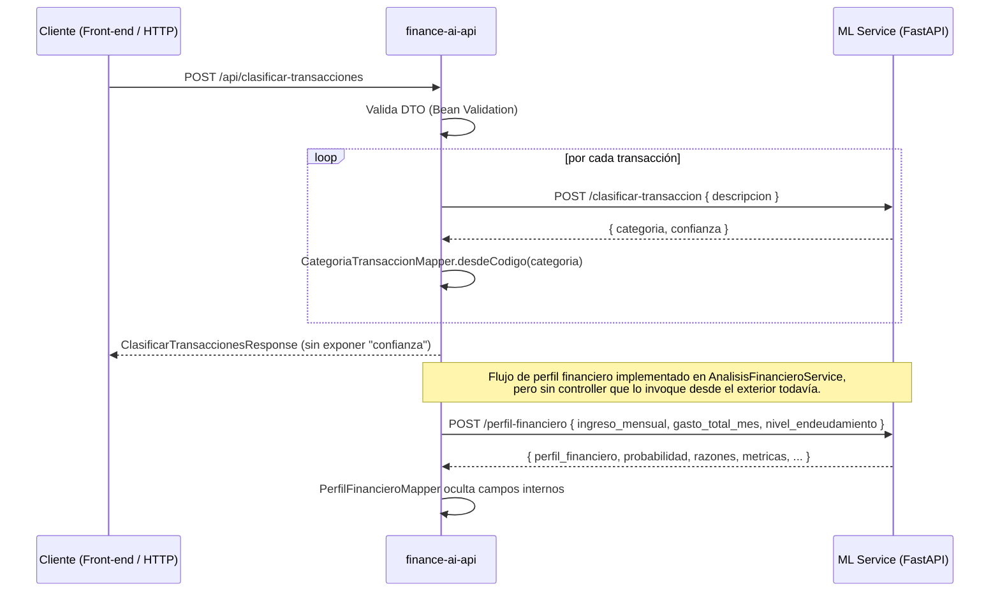
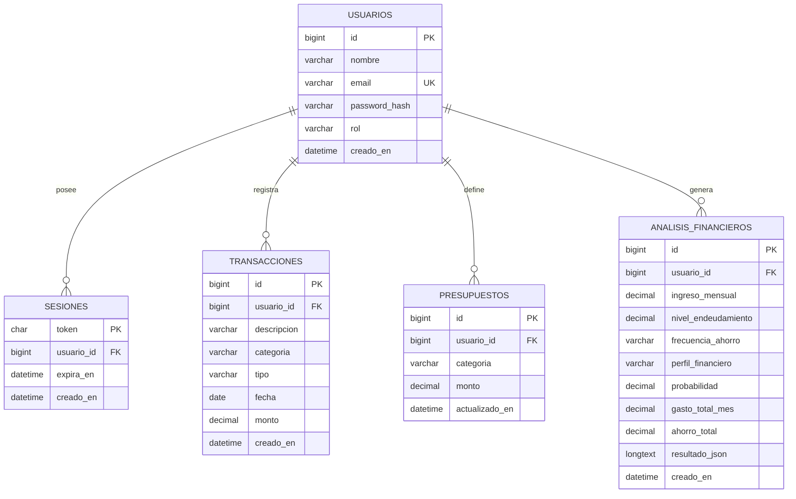

<div align="center">

# 💚 Salud Financiera

### Plataforma inteligente para el análisis y mejora de la salud financiera personal


</div>

---

> ⚠️ **Nota de auditoría (actualizada 2026-08-20):** este repositorio no tiene código fuente en la rama `main` — `main` solo contiene este README y el workflow de CI. El código real del proyecto está repartido en 8 ramas distintas que aún no se han integrado entre sí (ver [Estado real de las ramas](#-estado-real-de-las-ramas-y-del-código)). Las secciones de **Back-end** y **Base de datos** de este documento fueron auditadas al 100 % contra el código de la rama `feature/backend-clasificacion`, incluyendo los commits del 20/08/2026 que integran persistencia JPA (`usuarios`, `transacciones` contra MySQL 8.0, validado end-to-end) y la clasificación de transacciones vía servicio ML — ambos ya confirmados en el historial local del responsable de Back-end/BD. Las secciones de **Front-end**, **Machine Learning** y **OCI** se revisaron solo para dar contexto de arquitectura general y se dejan a cargo de sus responsables.

---

## 📚 Índice

- [Sobre el proyecto](#-sobre-el-proyecto)
- [Objetivos](#-objetivos)
- [Funcionalidades](#-funcionalidades)
- [Estado real de las ramas y del código](#-estado-real-de-las-ramas-y-del-código)
- [Arquitectura general](#️-arquitectura-general)
- [Arquitectura del frontend](#-arquitectura-del-frontend)
- [Arquitectura del backend](#️-arquitectura-del-backend)
- [Arquitectura de Machine Learning](#-arquitectura-de-machine-learning)
- [Arquitectura de base de datos](#️-arquitectura-de-base-de-datos)
- [Arquitectura OCI](#️-arquitectura-oci)
- [Tecnologías](#️-tecnologías)
- [Estructura general del proyecto](#-estructura-general-del-proyecto)
- [Organización del equipo](#-organización-del-equipo)
- [Instalación y ejecución](#-instalación-y-ejecución)
- [Variables de entorno](#-variables-de-entorno)
- [Pruebas](#-pruebas)
- [Documentación](#-documentación)
- [Estrategia de ramas](#-estrategia-de-ramas)
- [Roadmap](#-roadmap)
- [Estado actual del proyecto](#-estado-actual-del-proyecto)
- [Nota de seguridad](#-nota-de-seguridad)
- [Enlaces](#-enlaces)

---

## 📝 Sobre el proyecto

**Salud Financiera** es una plataforma web inteligente para el análisis de finanzas personales. Permite registrar ingresos y gastos, clasificar transacciones automáticamente, calcular indicadores financieros, identificar el perfil financiero del usuario y generar recomendaciones personalizadas.

El proyecto integra desarrollo web, arquitectura de software, análisis de datos, Machine Learning y servicios de Oracle Cloud Infrastructure. Se desarrolla en el contexto del **Hackathon ONE**, iniciativa de **Oracle Next Education y Alura**.

---

## 🎯 Objetivos

- Registrar ingresos y gastos.
- Clasificar automáticamente las transacciones.
- Organizar movimientos por categorías.
- Calcular ahorro, gastos, endeudamiento y puntaje financiero.
- Identificar perfiles saludables, en observación o en riesgo.
- Generar recomendaciones personalizadas.
- Mostrar dashboards e historial financiero.
- Procesar archivos CSV.
- Desplegar la solución en OCI.
- Mantener una arquitectura modular, escalable y documentada.

---

## 📌 Funcionalidades

La siguiente lista describe el alcance funcional objetivo del producto. La columna **Backend** indica si la funcionalidad está verificada en el código auditado de `feature/backend-clasificacion`; el resto de funcionalidades del producto (front-end, dashboards, recomendaciones) están fuera del alcance de esta auditoría y se mantienen tal como las documentó el equipo.

### Usuarios y seguridad

- Registro e inicio de sesión. — **Pendiente de implementación** en el backend auditado (no existe ningún endpoint, DTO ni dependencia de seguridad/JWT en `finance-ai-api`).
- JWT y refresh tokens. — **Pendiente de implementación**.
- Cierre de sesión. — **Pendiente de implementación**.
- Perfil de usuario. — **Pendiente de implementación**.
- Protección de rutas. — **Pendiente de implementación** (no hay `spring-boot-starter-security` en `pom.xml`).

### Transacciones

- Registro de ingresos y gastos (persistencia). — **Pendiente de implementación** (no hay entidades, repositorios ni datasource configurado).
- Consulta, edición y eliminación lógica. — **Pendiente de implementación**.
- Filtros y paginación. — **Pendiente de implementación**.
- Clasificación automática. — **Implementado**: `POST /api/clasificar-transacciones` delega en el servicio ML de clasificación.
- Clasificación por lotes. — **Implementado**: el mismo endpoint acepta una lista de transacciones en un solo request.

### Análisis financiero

- Cálculo de resumen financiero mensual (gasto total, ratio gasto/ingreso, nivel de endeudamiento). — **Implementado** en `CalculoFinancieroService` (con pruebas unitarias), pero **sin endpoint HTTP que lo exponga todavía**.
- Perfil financiero (Saludable / En observación / En riesgo) vía integración con ML. — **Implementado** a nivel de servicio (`AnalisisFinancieroService`, `PerfilFinancieroClient`), **sin endpoint HTTP que lo exponga todavía**.
- Resto de fórmulas de negocio (ahorro estimado, puntaje, categoría principal, gastos recurrentes) descritas más abajo en [Arquitectura de Machine Learning](#-arquitectura-de-machine-learning) — responsabilidad del equipo de Datos y ML, no verificadas en esta auditoría de backend.

### Perfil financiero

```text
Saludable        (endeudamiento ≤ 36% y ratio_gasto_ingreso ≤ 0.80)
En observación    (endeudamiento 36%-43% o ratio_gasto_ingreso 0.80-0.90)
En riesgo         (endeudamiento > 43% o ratio_gasto_ingreso > 0.90)
```

Se aplica el peor caso entre ambos criterios (enfoque conservador). Umbrales validados contra el framework de Debt-to-Income de Fannie Mae (Selling Guide B3-6-02) y la regla de ahorro 50/30/20. El veredicto siempre sale de estas reglas; el modelo entrenado (Árbol de Decisión) se usa para calcular la probabilidad/confianza asociada, no el veredicto en sí. *(Contenido de Machine Learning, conservado del README original — no verificado por esta auditoría de Back-end.)*

### Dashboard, archivos y recomendaciones

Sin cambios respecto a la documentación previa del equipo — pertenecen a Front-end, ML/Recomendaciones y OCI/Object Storage respectivamente. **Pendientes de verificación** por sus responsables.

---

## 🌳 Estado real de las ramas y del código

Esta sección es nueva: documenta lo que la auditoría encontró al inspeccionar el repositorio completo en GitHub, porque **la rama `main` no contiene código fuente**.

| Rama | Contenido | Último commit relevante |
|---|---|---|
| `main` | Solo `README.md` y `.github/workflows/ci.yml`. Sin código. | 09-ago-2026 |
| `feature/backend-clasificacion` | `finance-ai-api` (Java/Spring) — **rama documentada como Back-end en este README** | 11-ago-2026 (+ cambios locales del responsable de Back-end/BD aún no subidos a GitHub) |
| `backend` | Versión anterior/parcial de `finance-ai-api`, subconjunto de `feature/backend-clasificacion` | 27-jul-2026 |
| `frontend` | `financeAI` (React + TypeScript) | 27-jul-2026 |
| `feature/clasificador-gastos` | `ml-service` (módulo de clasificación) | 12-ago-2026 |
| `feature/perfil-financiero` | `ml-service/perfil` (módulo de perfil financiero) | 15-ago-2026 |
| `feature/recomendaciones` | `ml-service` (módulo de recomendaciones) | 09-ago-2026 |
| `tests/pruebas-de-contrato` | Carpeta `tests/` con pruebas de contrato | 09-ago-2026 |
| `proyecto-unificado-fase1` | Intento de unificación en un solo commit (`feat: unificar FinanceAI fase 1`): incluye `backend-financeAI/finance-ai-api` (**implementación de Back-end distinta y no relacionada con `feature/backend-clasificacion`**, con persistencia JPA, autenticación y presupuestos), `frontend-financeAI/financeAI`, `database/` (script SQL) y copias de las ramas de ML dentro de `feature-financeAI/` | 14-ago-2026 |

**Hallazgo clave:** `backend-financeAI/finance-ai-api` (dentro de `proyecto-unificado-fase1`) y `finance-ai-api` (dentro de `feature/backend-clasificacion`, la rama de trabajo real del responsable de Back-end/BD) son **dos implementaciones distintas que casi no comparten archivos entre sí**, aunque tengan el mismo nombre de carpeta. La primera aparece de golpe en un único commit de "unificación" y contiene persistencia (JPA) para 5 tablas, autenticación y presupuestos; la segunda es el desarrollo incremental y probado del responsable de Back-end/BD, con persistencia JPA propia en progreso (`usuarios` y `transacciones`, ver [Arquitectura de base de datos](#️-arquitectura-de-base-de-datos)), pero aún sin autenticación ni presupuestos. El equipo confirmó documentar la segunda como el Back-end vigente. La primera queda mencionada aquí únicamente porque el script `database/001_schema.sql` (documentado en la sección de Base de Datos) fue diseñado para ella.

---

# 🏗️ Arquitectura general

```text
┌───────────────────────────────────────────────────────────────┐
│                         USUARIO                               │
└───────────────────────────────┬───────────────────────────────┘
                                │ HTTPS
                                ▼
┌───────────────────────────────────────────────────────────────┐
│             FRONTEND: financeAI (React + TypeScript)          │
└───────────────────────────────┬───────────────────────────────┘
                                │ API REST / JSON (integración pendiente de verificar)
                                ▼
┌───────────────────────────────────────────────────────────────┐
│            BACKEND: finance-ai-api (Java 17 + Spring Boot)    │
│   Implementado: GET /api/health, POST /api/clasificar-...     │
│   En desarrollo (sin endpoint): resumen y perfil financiero   │
└────────────────────┬───────────────────────┬──────────────────┘
                     │ Sin datasource         │ HTTP (RestClient)
                     │ configurado (pendiente)│
                     ▼                       ▼
┌────────────────────────────┐   ┌──────────────────────────────┐
│ MySQL                       │   │ ML Service (Python/FastAPI) │
│ Pendiente de integración    │   │ clasificador · perfil ·     │
│ (schema SQL preliminar      │   │ recomendaciones             │
│ existe en otra rama)        │   │                              │
└────────────────────────────┘   └──────────────┬───────────────┘
                                               │ OCI SDK (no verificado)
                                               ▼
                                ┌──────────────────────────────┐
                                │ OCI Object Storage           │
                                │ Pendiente de verificación     │
                                └──────────────────────────────┘
```

### Flujo real verificado (Back-end)

```text
Usuario → (Front-end, no verificado en esta auditoría) → finance-ai-api
                                                              │
                                            ┌─────────────────┴─────────────────┐
                                            ▼                                   ▼
                          POST /api/clasificar-transacciones      (sin endpoint todavía)
                          → ClasificadorGastosClient               → AnalisisFinancieroService
                          → POST {ml-service}/clasificar-transaccion  → PerfilFinancieroClient
                                                                       → POST {ml-service}/perfil-financiero
```

No existe todavía ningún flujo verificado hacia MySQL ni hacia OCI desde el backend auditado.

---

# 💻 Arquitectura del frontend

> **Pendiente de revisión y actualización por el responsable de Front-end.** Esta sección se conserva del README anterior. La auditoría solo confirmó, a nivel de estructura de carpetas en la rama `proyecto-unificado-fase1` (`frontend-financeAI/financeAI/src`), que el proyecto usa Vite + React + TypeScript y que la carpeta raíz de código fuente se organiza como `aplicacion/`, `compartido/`, `modulos/` y `recursos/` — nombres en español que **no coinciden** con la convención `domain/application/infrastructure/presentation` descrita más abajo. Se deja la descripción original intacta para que el responsable de Front-end la confirme o la corrija; no se investigó el contenido interno de cada módulo.

## Nombre

```text
financeAI (verificado) — antes documentado como "salud-financiera"
```

## Responsabilidad

Presentar la interfaz, gestionar formularios, mostrar gráficos y consumir la API REST. No accede directamente a MySQL ni al servicio ML.

## Capas (según documentación previa del equipo — no verificadas en detalle por esta auditoría)

```text
domain
application
infrastructure
presentation
```

- **Domain:** entidades, tipos e interfaces.
- **Application:** hooks, queries, mutaciones y casos de uso.
- **Infrastructure:** Axios, repositorios HTTP, adaptadores e interceptores.
- **Presentation:** páginas, componentes, formularios, tablas y gráficos.

### Componentes

### Instalación

### Ejecución

### Integración con Back-end

Actualmente el backend auditado (`feature/backend-clasificacion`) solo expone `GET /api/health` y `POST /api/clasificar-transacciones`; cualquier integración de Front-end con dashboards, autenticación o persistencia de transacciones dependerá de endpoints que **todavía no existen** en esa rama.

---

# ⚙️ Arquitectura del backend

> Auditado al 100 % contra el código de `finance-ai-api` en la rama `feature/backend-clasificacion`, incluyendo los archivos ya presentes en el entorno local del responsable de Back-end/BD que aún no se han subido a GitHub (integración del clasificador de gastos: `ClasificadorGastosClient`, `dto/clasificacion/*`, `mapper/CategoriaTransaccionMapper` y sus pruebas).

## Nombre

```text
finance-ai-api
```

## Responsabilidad

Clasificar transacciones (delegando en el servicio ML de clasificación) y orquestar el cálculo del resumen financiero y el perfil financiero (delegando en el servicio ML de perfil financiero). **Todavía no** accede a una base de datos ni implementa autenticación.

## Tecnologías y versiones (verificadas en `pom.xml`)

| Tecnología | Versión / detalle |
|---|---|
| Java | 17 (`<java.version>17</java.version>`) |
| Spring Boot (parent) | 4.1.0 |
| Build | Maven, con Maven Wrapper (`mvnw` / `mvnw.cmd`) |
| Spring Web | `spring-boot-starter-webmvc` |
| Bean Validation | `spring-boot-starter-validation` |
| Lombok | presente como dependencia opcional, excluida del artefacto final por el plugin de Spring Boot |
| DevTools | `spring-boot-devtools` (scope `runtime`, opcional) |
| Cliente HTTP | `RestClient` de Spring (bean `mlRestClient`), no WebClient ni RestTemplate |
| Pruebas | `spring-boot-starter-webmvc-test`, `spring-boot-starter-validation-test`, JUnit 5, Mockito, AssertJ, `MockRestServiceServer` |

**No están presentes**: Spring Data, JPA, Hibernate, ningún driver JDBC/MySQL, Spring Security, JWT, Swagger/OpenAPI, ni Prisma. El README anterior mencionaba varias de estas tecnologías para el backend por error (describía un stack Node.js/Express/Prisma que no corresponde al código Java actual).

## Estructura real de paquetes (`src/main/java/com/financeai`)

```text
com.financeai
├── classification/  # Catálogo de las 12 categorías (enum CategoriaTransaccion) y ResultadoClasificacion
├── client/          # Clientes HTTP hacia ML: PerfilFinancieroClient, ClasificadorGastosClient
├── config/          # MlClientConfig: define el bean RestClient hacia el servicio ML
├── controller/      # ClasificacionController, HealthController
├── domain/          # ResumenFinanciero, TipoTransaccion, TransaccionClasificada
├── dto/             # Contratos JSON de entrada y salida
│   ├── analisis/    # AnalisisFinancieroResponse (respuesta pública del análisis financiero)
│   ├── clasificacion/ # ClasificadorGastosRequest / ClasificadorGastosResponse (contrato con ML)
│   └── perfil/      # PerfilFinancieroRequest / PerfilFinancieroResponse / PerfilFinancieroMetricasResponse
├── exception/       # GlobalExceptionHandler (manejo centralizado de validación)
├── mapper/          # CategoriaTransaccionMapper, PerfilFinancieroMapper, PerfilFinancieroRequestMapper
└── service/         # AnalisisFinancieroService, CalculoFinancieroService, ClasificacionTransaccionService
```

No existe un paquete `util`, `repository` ni `entity`: no hay persistencia implementada todavía.

### Responsabilidades por paquete

- `client`: integra el backend con los dos servicios ML disponibles hoy (`PerfilFinancieroClient` → `POST {base-url}/perfil-financiero`, `ClasificadorGastosClient` → `POST {base-url}/clasificar-transaccion`), usando el mismo `RestClient` configurado con `financeai.ml.base-url`.
- `mapper`: convierte entre contratos ML y el dominio Java (`CategoriaTransaccionMapper` normaliza el código de categoría devuelto por ML al enum `CategoriaTransaccion`); adapta la respuesta interna del perfil financiero a la respuesta pública, ocultando campos internos (`_inconsistencia_ahorro`, `_fuente_prediccion`).
- `service`: `ClasificacionTransaccionService` valida la descripción y delega en ML; `CalculoFinancieroService` calcula gasto total, deudas, ratio gasto/ingreso y nivel de endeudamiento sobre listas de transacciones en memoria (no persistidas); `AnalisisFinancieroService` orquesta el mapeo de un `ResumenFinanciero` hacia la solicitud de perfil financiero y expone la respuesta pública — **no está conectado a ningún controller todavía**.
- `controller`: expone únicamente `GET /api/health` y `POST /api/clasificar-transacciones`.
- `exception`: traduce errores de validación (`MethodArgumentNotValidException`) y de cuerpo JSON inválido (`HttpMessageNotReadableException`) a `ErrorValidacionResponse` con status 400.

### Estructura de pruebas (`src/test/java/com/financeai`)

```text
src/test/java/com/financeai
├── client/      # ClasificadorGastosClientTest, PerfilFinancieroClientTest (MockRestServiceServer)
├── controller/  # ClasificacionControllerTest (@WebMvcTest + MockMvc)
├── mapper/      # CategoriaTransaccionMapperTest, PerfilFinancieroMapperTest, PerfilFinancieroRequestMapperTest
├── service/     # AnalisisFinancieroServiceTest, CalculoFinancieroServiceTest, ClasificacionTransaccionServiceTest
└── FinanceAiApiApplicationTests.java # Carga del contexto Spring
```

10 clases de prueba en total. No hay pruebas de integración end-to-end ni de `repository` (porque no existe capa de persistencia).

## API REST

No hay prefijo `/api/v1`; las rutas verificadas son:

| Método | Endpoint | Descripción | Estado |
|---|---|---|---|
| GET | `/api/health` | Devuelve `status`, `application`, `version` y `timestamp` del servicio | Implementado |
| POST | `/api/clasificar-transacciones` | Clasifica una o más transacciones por su descripción, delegando en el servicio ML de clasificación de gastos | Implementado |

No existen endpoints para autenticación, persistencia de transacciones, presupuestos, historial ni análisis/perfil financiero público — estos últimos tienen la lógica de negocio ya implementada y probada (`AnalisisFinancieroService`, `CalculoFinancieroService`) pero **sin controller que los exponga**.

### Validaciones y errores (`POST /api/clasificar-transacciones`)

- `descripcion`: obligatoria (`@NotBlank`).
- `valor`: obligatorio, mínimo `0.01` (`@DecimalMin`).
- `fecha`: obligatoria, no puede ser futura (`@PastOrPresent`).
- `tipo`: obligatorio (`GASTO`, `INGRESO` o `AHORRO`); un valor no reconocido en el JSON produce un `HttpMessageNotReadableException`.
- Ambos casos devuelven **400** con `ErrorValidacionResponse { timestamp, status, mensaje, errores }`.

## DTO y contratos JSON (verificados en el código y en las pruebas)

**`POST /api/clasificar-transacciones` — request:**
```json
{
  "transacciones": [
    {
      "descripcion": "Uber al trabajo",
      "valor": 45.00,
      "fecha": "2026-07-26",
      "tipo": "GASTO"
    }
  ]
}
```

**`POST /api/clasificar-transacciones` — response:**
```json
{
  "cantidadTransacciones": 1,
  "transacciones": [
    {
      "descripcion": "Uber al trabajo",
      "valor": 45.00,
      "fecha": "2026-07-26",
      "moneda": "USD",
      "tipo": "GASTO",
      "categoria": "transporte"
    }
  ]
}
```

Nótese que la `confianza` del clasificador **no se expone** en la respuesta pública (permanece interna, verificado por `ClasificacionControllerTest`).

**Contrato interno con el clasificador ML (`ClasificadorGastosRequest`/`Response`, verificado por pruebas de `ClasificadorGastosClient` y `ClasificacionTransaccionService` — el archivo fuente de estos dos DTO no pudo leerse directamente por una limitación de la herramienta de auditoría, pero su forma exacta quedó confirmada por las pruebas unitarias que instancian y usan sus campos):**
```json
// Request → POST {ml-service}/clasificar-transaccion
{ "descripcion": "Uber al trabajo" }

// Response
{ "categoria": "transporte", "confianza": 0.98 }
```

**Contrato interno con el servicio de perfil financiero (no expuesto públicamente todavía):**
```json
// PerfilFinancieroRequest → POST {ml-service}/perfil-financiero
{
  "ingreso_mensual": 1000.00,
  "gasto_total_mes": 500.00,
  "nivel_endeudamiento": 20.0000
}

// PerfilFinancieroResponse
{
  "perfil_financiero": "Saludable",
  "probabilidad": 0.98,
  "razones": ["Endeudamiento controlado", "Gasto razonable frente al ingreso"],
  "metricas": {
    "ratio_gasto_ingreso": 0.5,
    "nivel_endeudamiento": 20.0,
    "frecuencia_ahorro": "Alta",
    "ahorro_estimado_pct": 0.3
  },
  "_inconsistencia_ahorro": null,
  "_fuente_prediccion": "reglas y modelo"
}
```

`AnalisisFinancieroResponse` (la versión pública que se enviaría al Front-end cuando exista el endpoint) es la misma estructura sin `_inconsistencia_ahorro` ni `_fuente_prediccion`.

## Categorías de clasificación (`CategoriaTransaccion`, 12 valores verificados)

```text
profesionales · mascotas · alimentacion · transporte · salud · educacion
entretenimiento · deudas · impuestos_y_seguros · cuidado_personal · vivienda · otros
```

## Integración Back-end ↔ Machine Learning



- **Cliente HTTP:** `RestClient` de Spring, un único bean `mlRestClient` configurado con `financeai.ml.base-url` (`config/MlClientConfig.java`), reutilizado por ambos clientes.
- **URL configurable:** `financeai.ml.base-url=${ML_SERVICE_BASE_URL:http://localhost:8000}` (`application.properties`).
- **Timeouts:** no configurados explícitamente (se usan los valores por defecto del `RestClient`/`JdkClientHttpRequestFactory`) — **pendiente de definir**.
- **Manejo de errores del cliente ML:** no hay un `try/catch` específico para errores de red o respuestas 4xx/5xx del servicio ML en `PerfilFinancieroClient` ni `ClasificadorGastosClient`; una respuesta nula lanza `NullPointerException` con mensaje explícito, y cualquier excepción de `RestClient` (por ejemplo `RestClientResponseException`) se propaga sin traducirse a un error HTTP específico — **pendiente de manejo de errores más granular**.

*(Límite de responsabilidad: lo anterior documenta cómo el Back-end consume ML. El dataset, entrenamiento, algoritmo y métricas del modelo son responsabilidad del equipo de Machine Learning — ver la siguiente sección.)*

---

# 🤖 Arquitectura de Machine Learning

> **Pendiente de revisión y actualización por el responsable de Machine Learning.** Se conserva la documentación previa del equipo. La auditoría solo verificó, a nivel de estructura de carpetas, que la rama `feature/perfil-financiero` (la más reciente, 15-ago-2026) organiza el módulo de perfil financiero como `ml-service/perfil/` (`api_perfil.py`, `perfil_financiero.py`, `modelo_perfil_financiero.pkl`, `requirements.txt`, notebook, pruebas y `Dockerfile`), y que `feature/clasificador-gastos` y `feature/recomendaciones` usan también el prefijo `ml-service/<módulo>/` — nombres de carpeta que **no coinciden exactamente** con `backend_module/` mencionado más abajo. Se deja la descripción funcional original intacta porque documenta reglas de negocio (umbrales, fórmulas) que no se pueden invalidar solo con la estructura de carpetas.

## Nombre

```text
ml-service (Perfil Financiero)
```

> Nota original del equipo: esta sección documenta la arquitectura real construida para el módulo de **Perfil Financiero**. El módulo de **Clasificación de Gastos** (modelo, notebook y diccionario de palabras clave) vive en la rama `feature/clasificador-gastos`. El módulo de **Recomendaciones** vive en la rama `feature/recomendaciones`. Ninguno de los tres está integrado en `main`.

## Responsabilidades (Perfil Financiero)

- Calcular el perfil financiero del usuario (Saludable / En observación / En riesgo) mediante reglas de negocio.
- Cargar el modelo entrenado (Árbol de Decisión) y usarlo para calcular la probabilidad/confianza del veredicto.
- Calcular `ratio_gasto_ingreso` y `ahorro_estimado_pct` a partir de los datos que entrega backend.
- Generar la explicabilidad (`razones`) de cada veredicto.
- Exponer el resultado vía API REST para que backend lo consuma (contrato verificado y documentado arriba, en la sección de Back-end).

## Endpoints internos (según documentación del equipo de ML — contrato confirmado desde el lado Back-end)

```text
GET  /health
POST /perfil-financiero
```

## Diseño del modelo: reglas + modelo entrenado (híbrido)

El **veredicto** (`perfil_financiero`) siempre sale de reglas de negocio deterministas (umbrales validados contra el framework DTI de Fannie Mae y la regla de ahorro 50/30/20). El **modelo entrenado** (cargado desde el `.pkl`) se usa exclusivamente para calcular `probabilidad` — su nivel de confianza en ese mismo veredicto. Si el modelo falla al cargar, hay fallback automático a reglas puras. *(Contenido conservado del README original — no verificado por esta auditoría.)*

## Contrato con Backend (unidades)

| Campo | Unidad | Quién lo calcula |
|---|---|---|
| `ingreso_mensual`, `gasto_total_mes` | Monto plano, misma moneda | Backend |
| `nivel_endeudamiento` | Porcentaje 0–100 | Backend (`totalDeudasMes / ingresoMensual × 100`, verificado en `CalculoFinancieroService`) |
| `ratio_gasto_ingreso`, `ahorro_estimado_pct`, `probabilidad` | Fracción 0–1 | Módulo ML (no se recalculan en backend) |

---

# 🗄️ Arquitectura de base de datos

> **Base de datos: integración JPA en progreso, confirmada para `usuarios` y `transacciones`.** Desde el 20/08/2026, `feature/backend-clasificacion` incluye `spring-boot-starter-data-jpa` y `mysql-connector-j` en `pom.xml`, junto con las propiedades `spring.datasource.*` en `application.properties` (usuario y contraseña vía variables de entorno `DB_USER`/`DB_PASSWORD`, sin valor por defecto para la contraseña). Existen las entidades `Usuario` y `Transaccion` (`persistence/entity`), validadas contra una instancia real de MySQL 8.0 con `spring.jpa.hibernate.ddl-auto=validate` — la aplicación arranca correctamente y `GET /api/health` responde con la base de datos conectada. `CalculoFinancieroService` **todavía** opera en memoria sobre listas recibidas por parámetro; no hay repositorios (`JpaRepository`) ni servicios que lean/escriban las entidades desde los endpoints todavía — ese es el siguiente paso (Día 2).

## Script SQL preliminar (diseño, no conectado al backend documentado)

Existe un script de base de datos en la rama `proyecto-unificado-fase1` (`database/001_schema.sql` y `database/002_seed.sql`), diseñado junto con la implementación de backend alternativa (`backend-financeAI/finance-ai-api`, con persistencia JPA) que el equipo **no** eligió documentar como la vigente en este README (ver [Estado real de las ramas](#-estado-real-de-las-ramas-y-del-código)). Se documenta aquí como referencia de diseño porque es el único artefacto de base de datos verificable en todo el repositorio.

### Motor de base de datos

MySQL / MariaDB (según `database/README.md` de esa rama: "MariaDB 10.4 de XAMPP, compatible con MySQL" para el entorno local).

### Tablas (verificadas en `database/001_schema.sql`)

```text
usuarios
sesiones
transacciones
presupuestos
analisis_financieros
```

No existen carpetas `migrations/`, `rollback/`, `seeds/` ni `docs/` dentro de `database/` como describía el README anterior — solo `001_schema.sql`, `002_seed.sql` (vacío, reservado para semillas futuras) y `README.md`.

### Relaciones (Many-to-One hacia `usuarios` en todos los casos, `ON DELETE CASCADE`)



Reglas verificadas en el script: `usuarios.email` es único; `presupuestos` tiene índice único por `(usuario_id, categoria)`; todos los montos usan `DECIMAL`, no `FLOAT`.

### Entities y Repositories

En `feature/backend-clasificacion` (paquete `com.financeai.persistence.entity`) existen `Usuario` y `Transaccion`, mapeadas 1:1 contra las tablas `usuarios` y `transacciones` descritas arriba. Todavía no hay repositorios `JpaRepository` — las entidades están validadas por Hibernate pero ningún servicio las usa aún para leer o escribir datos. Las tablas `sesiones`, `presupuestos` y `analisis_financieros` (y sus entidades equivalentes) siguen sin implementarse; su diseño de referencia sigue siendo el de `proyecto-unificado-fase1` documentado en el diagrama de arriba.

### Inicialización

Según `database/README.md` (rama `proyecto-unificado-fase1`): el esquema se crea manualmente ejecutando `001_schema.sql` contra una instancia local de MariaDB/XAMPP. No hay Flyway ni Liquibase configurados en ningún `pom.xml` del proyecto.

---

# ☁️ Arquitectura OCI

> **Pendiente de revisión y actualización por el responsable de OCI.** Se conserva la documentación previa del equipo, que describe una arquitectura objetivo. La auditoría solo confirmó qué artefactos de infraestructura existen realmente hoy en el repositorio (ver nota abajo); no se encontró ningún archivo de configuración de OCI, Terraform, ni `docker-compose.yml` en ninguna rama.

```text
┌──────────────────────────────────────────────────────────────────────┐
│                              INTERNET                                │
└──────────────────────────────────┬───────────────────────────────────┘
                                   │ HTTPS
                                   ▼
┌──────────────────────────────────────────────────────────────────────┐
│                        OCI API Gateway                               │
└──────────────────────────────────┬───────────────────────────────────┘
                                   ▼
┌──────────────────────────────────────────────────────────────────────┐
│                   Virtual Cloud Network - VCN                        │
│                                                                      │
│  SUBRED PÚBLICA                                                      │
│  └── Frontend React + Nginx                                          │
│                                                                      │
│  SUBRED PRIVADA                                                      │
│  ├── Backend Express                                                 │
│  ├── FastAPI ML                                                      │
│  └── MySQL HeatWave                                                  │
└──────────────────────────────────┬───────────────────────────────────┘
                                   ▼
┌──────────────────────────────────────────────────────────────────────┐
│                        OCI Object Storage                            │
│                 Modelos, datasets, CSV y reportes                    │
└──────────────────────────────────────────────────────────────────────┘
```

*(Diagrama objetivo conservado del README original — ninguno de estos componentes está desplegado ni configurado como código en el repositorio auditado.)*

## Servicios OCI (objetivo, no verificado)

| Servicio | Uso |
|---|---|
| API Gateway | Entrada pública, CORS, autorización y rate limiting |
| Container Registry | Almacenamiento de imágenes Docker |
| Container Instances | Ejecución de frontend, backend y ML |
| MySQL HeatWave | Base de datos administrada |
| Object Storage | Modelos, datasets, CSV y reportes |
| Vault | Secretos, contraseñas y claves |
| IAM | Usuarios, grupos, roles y políticas |
| Logging | Centralización de logs |
| Monitoring | Métricas, alarmas y disponibilidad |

## Artefactos de infraestructura verificados hoy en el repositorio

Solo existen 3 `Dockerfile` en todo el repositorio (ninguno para el backend Java auditado):

```text
frontend-financeAI/financeAI/Dockerfile
feature-financeAI/.../feature-clasificador-gastos/ml-service/clasificador/Dockerfile
feature-financeAI/.../feature-recomendaciones/ml-service/recomendaciones/Dockerfile
```

No hay `docker-compose.yml`, carpeta `infrastructure/`, plantillas Terraform ni ningún otro artefacto de despliegue OCI en el repositorio.

---

# 🛠️ Tecnologías

| Categoría | Tecnologías |
|---|---|
| Frontend | React, TypeScript, Vite (según `package.json`/estructura verificada); resto de la lista original (React Router, TanStack Query, Axios, React Hook Form, Zod, Tailwind CSS, Recharts) **pendiente de verificación** por el responsable de Front-end |
| Backend | **Java 17, Spring Boot 4.1.0 (Web MVC, Validation, DevTools, Data JPA), Lombok, Spring `RestClient`, MySQL Connector/J, JUnit 5, Mockito, AssertJ, `MockRestServiceServer`** — verificado en `pom.xml`. *(Corrige la versión anterior, que describía Node.js/Express/Prisma/JWT/Swagger, stack no encontrado en el código actual.)* |
| Machine Learning | Python, FastAPI, Scikit-learn (Árbol de Decisión), Joblib — según documentación del equipo de ML, no auditado en profundidad |
| Base de datos | MySQL 8.0 — **integrado parcialmente** (`usuarios`, `transacciones` vía JPA/Hibernate; el resto del esquema sigue como diseño de referencia) (ver [Arquitectura de base de datos](#️-arquitectura-de-base-de-datos)) |
| Infraestructura | Docker (solo para frontend y 2 módulos de ML); Docker Compose y OCI — **pendientes**, sin artefactos en el repositorio |
| Pruebas | Backend: JUnit 5, Mockito, AssertJ, Spring `MockRestServiceServer`, `MockMvc` (verificado). Resto (Vitest, React Testing Library, Pytest) — no verificado en esta auditoría |
| Herramientas | Git, GitHub, GitHub Actions (CI verificado en `.github/workflows/ci.yml`) |

---

# 📂 Estructura general del proyecto

El repositorio **no tiene hoy una carpeta única con todo el proyecto integrado**: cada componente vive en una rama distinta (ver [Estado real de las ramas](#-estado-real-de-las-ramas-y-del-código)). La estructura interna del Back-end auditado es:

```text
finance-ai-api/                       # rama feature/backend-clasificacion
├── src/
│   ├── main/
│   │   ├── java/com/financeai/
│   │   │   ├── classification/
│   │   │   ├── client/
│   │   │   ├── config/
│   │   │   ├── controller/
│   │   │   ├── domain/
│   │   │   ├── dto/{analisis,clasificacion,perfil}/
│   │   │   ├── exception/
│   │   │   ├── mapper/
│   │   │   └── service/
│   │   └── resources/
│   │       └── application.properties
│   └── test/java/com/financeai/{client,controller,mapper,service}/
├── .mvn/, mvnw, mvnw.cmd
├── pom.xml
└── finance-ai-api.http
```

El script de base de datos preliminar vive por separado en `database/` (rama `proyecto-unificado-fase1`), y el Front-end y los módulos de ML viven cada uno en su propia rama, listados en la tabla de [Estado real de las ramas](#-estado-real-de-las-ramas-y-del-código).

---

# 👥 Organización del equipo

| Grupo | Participantes | Responsabilidad |
|---|---:|---|
| Frontend | 1 y 2 | Interfaz, dashboard, formularios e integración |
| Backend y BD | 3 y 4 | API, seguridad, base de datos y análisis |
| Datos y ML | 5 y 6 | Dataset, modelo, FastAPI y recomendaciones |
| Integración y OCI | 7 | Arquitectura, Docker, OCI, documentación y despliegue |

### Grupo 1: Frontend

- Participante 1: diseño, componentes y experiencia de usuario.
- Participante 2: integración, consultas, gráficos y pruebas.

### Grupo 2: Backend y base de datos

- Participante 3: autenticación, seguridad, API.
- Participante 4: base de datos, transacciones, análisis e integración ML.

### Grupo 3: Ciencia de Datos y Machine Learning

- Participante 5: dataset, análisis exploratorio y entrenamiento.
- Participante 6: FastAPI, clasificación, perfil y recomendaciones.

### Participante 7: Integración y OCI

- Arquitectura general.
- Git y pull requests.
- Docker y Docker Compose.
- OCI.
- Seguridad.
- Documentación.
- Pruebas integrales.
- Despliegue y demostración.

---

# 🚀 Instalación y ejecución

## Backend (`finance-ai-api`, verificado)

### Requisitos

- Java 17 o superior (según `pom.xml`).
- No es necesario tener Maven instalado: el proyecto incluye Maven Wrapper (`mvnw` / `mvnw.cmd`).
- Un servicio ML alcanzable (perfil y/o clasificador) si se quiere probar la integración completa; el endpoint implementado (`/api/clasificar-transacciones`) requiere que el clasificador esté disponible.
- No se requiere base de datos para ejecutar el backend actual (no está integrada).

### Clonar y ejecutar

```bash
git clone https://github.com/No-Country-simulation/G9-LATAM-Team-80-FinanceAI.git
cd G9-LATAM-Team-80-FinanceAI
git checkout feature/backend-clasificacion
cd finance-ai-api

# Linux/macOS
./mvnw spring-boot:run

# Windows
mvnw.cmd spring-boot:run
```

### Puerto

`8080` (por defecto de Spring Boot; no hay `server.port` configurado en `application.properties`).

### Health check (verificado)

```bash
curl http://localhost:8080/api/health
```

### Ejemplos de uso

El propio repositorio incluye `finance-ai-api/finance-ai-api.http` con ejemplos de las 3 solicitudes verificadas (health, clasificación válida, clasificación inválida) listos para ejecutar desde un cliente `.http`.

## Frontend y Machine Learning

**Pendientes de verificación por sus responsables.** No se documentan pasos de instalación aquí para evitar inventar comandos no verificados; el README anterior incluía un flujo `docker compose up --build` que no corresponde a ningún `docker-compose.yml` existente en el repositorio.

---

# 🔐 Variables de entorno

## Backend (verificadas en `application.properties`)

```env
ML_SERVICE_BASE_URL=
```

- `ML_SERVICE_BASE_URL`: sobrescribe `financeai.ml.base-url`, que por defecto es `http://localhost:8000`. Es la única variable de entorno que el backend auditado lee actualmente. No existen variables de base de datos, JWT ni seguridad en este código, porque esas capas todavía no están implementadas.

## Frontend y Machine Learning

**Pendientes de verificación por sus responsables.** El README anterior enumeraba `VITE_API_BASE_URL`, variables de base de datos y de OCI para estos componentes; no se corrigen ni se eliminan aquí para no invadir su documentación, pero deben confirmarse contra el código real de cada rama.

No se deben subir archivos `.env` al repositorio.

---

# ✅ Pruebas

## Backend (verificado)

```bash
cd finance-ai-api

# Linux/macOS
./mvnw test

# Windows
mvnw.cmd test
```

10 clases de prueba, organizadas por capa (`client`, `controller`, `mapper`, `service`, más la prueba de carga de contexto `FinanceAiApiApplicationTests`). Usan JUnit 5, Mockito, AssertJ y `MockRestServiceServer`/`MockMvc` — no hay pruebas de `repository` porque no existe capa de persistencia. El workflow de CI (`.github/workflows/ci.yml`, definido en `main`) ejecuta `mvn test` sobre un directorio `finance-ai-api` en la raíz del repositorio, lo cual **no coincide** con la ubicación real de ese proyecto dentro de la rama `feature/backend-clasificacion` (está en la raíz de esa rama, pero el workflow vive en una rama distinta que no lo integra) — **inconsistencia a resolver por el equipo**.

## Frontend y Machine Learning

**Pendientes de verificación por sus responsables.**

---

# 📖 Documentación

La carpeta `docs/` mencionada en versiones anteriores de este README **no existe todavía** en ninguna rama auditada. Solo se encontró `descripcion-del-proyecto.md` en la raíz de `proyecto-unificado-fase1`. Se recomienda al equipo crear la carpeta `docs/` cuando existan los documentos, en vez de listarla como si ya existiera.

---

# 🌿 Estrategia de ramas

**Ramas verificadas actualmente en el repositorio remoto** (`git ls-remote`, 17-ago-2026):

```text
main
backend
frontend
feature/backend-clasificacion
feature/clasificador-gastos
feature/perfil-financiero
feature/recomendaciones
proyecto-unificado-fase1
tests/pruebas-de-contrato
```

Ninguna de las ramas de funcionalidad está todavía fusionada en `main`. El listado de ramas que describía el README anterior (`develop`, `feature/frontend-auth`, `feature/frontend-dashboard`, `feature/backend-auth`, `feature/backend-transactions`, `feature/database-initial-schema`, `feature/ml-classifier`, `feature/ml-api`, `feature/oci-deployment`) **no corresponde** a las ramas reales del repositorio y se reemplaza por la lista verificada de arriba.

Reglas (conservadas del README original):

1. No desarrollar directamente en `main`.
2. Crear una rama por funcionalidad.
3. Integrar mediante pull request.
4. Solicitar revisión.
5. Ejecutar pruebas.
6. Actualizar documentación.

---

# 📅 Roadmap

- [x] Definición del problema.
- [x] Organización del equipo.
- [x] Selección de tecnologías.
- [x] Arquitectura general.
- [x] Arquitectura OCI.
- [x] Inicialización del frontend.
- [x] Inicialización del backend.
- [x] Creación de base de datos. *(MySQL 8.0 creada localmente, con las tablas `usuarios` y `transacciones`; integración JPA validada — resto del esquema de referencia aún sin crear)*
- [ ] Autenticación. *(confirmado pendiente en la rama documentada)*
- [x] Transacciones. *(clasificación implementada; persistencia/CRUD sigue pendiente)*
- [ ] Dataset y modelo ML. *(fuera del alcance de esta auditoría)*
- [x] Servicio FastAPI. *(existe según estructura de ramas de ML, no auditado en profundidad)*
- [x] Integración backend-ML. *(clasificación integrada end-to-end; perfil financiero integrado a nivel de servicio, sin endpoint público)*
- [ ] Dashboard.
- [ ] Procesamiento CSV.
- [ ] Pruebas integrales. *(hay pruebas unitarias por capa; no hay pruebas de integración entre componentes)*
- [ ] Despliegue en OCI.
- [ ] Demostración final.

---

# 📊 Estado actual del proyecto

| Componente | Estado | Evidencia |
|---|---|---|
| Front-end | En desarrollo | Código en ramas `frontend` y `proyecto-unificado-fase1`; no integrado con el backend auditado. Pendiente de revisión por su responsable. |
| Back-end | En desarrollo | Clasificación de transacciones implementada y probada end-to-end (integrada con servicio ML); cálculo de resumen y perfil financiero implementados a nivel de servicio pero sin endpoint público; persistencia JPA integrada para `usuarios`/`transacciones` (validada contra MySQL real); sin autenticación ni repositorios todavía. |
| Machine Learning | En desarrollo / en integración | 3 módulos (`clasificador`, `perfil`, `recomendaciones`) en ramas separadas, cada uno con su propio estado; el contrato de `perfil-financiero` está confirmado desde el lado Back-end. Pendiente de revisión por su responsable. |
| Base de datos | Integración parcial | MySQL 8.0 local con las tablas `usuarios` y `transacciones`, mapeadas por JPA/Hibernate y validadas en el arranque de la aplicación. El script SQL preliminar (`database/001_schema.sql`, 5 tablas), diseñado para una implementación de backend distinta, sigue como referencia para `sesiones`, `presupuestos` y `analisis_financieros`, aún no creadas. |
| OCI / Infraestructura | Pendiente | Sin artefactos de despliegue OCI en el repositorio; solo 3 `Dockerfile` (frontend y 2 módulos de ML). Pendiente de revisión por su responsable. |
| Integración entre ramas | Pendiente | 8 ramas de trabajo activas, ninguna fusionada en `main`; existe un intento de unificación (`proyecto-unificado-fase1`) con una implementación de backend alternativa no elegida por el equipo. |

---

# 🔒 Nota de seguridad

Durante la auditoría se encontraron credenciales en texto plano en el repositorio (rama `proyecto-unificado-fase1`, **no** en la rama de Back-end documentada en este README):

- `database/001_schema.sql`: sentencias `CREATE USER` / `ALTER USER` con una contraseña de MySQL en texto plano para el usuario `financeai_app`.
- `backend-financeAI/finance-ai-api/src/main/resources/application.properties`: la misma contraseña embebida como valor por defecto de `spring.datasource.password`.

Estas credenciales **no se reproducen en este README** y los archivos que las contienen **no fueron modificados** (esta auditoría solo tiene permiso para editar `README.md`). Se recomienda al equipo rotar esa contraseña y moverla a una variable de entorno o a OCI Vault antes de cualquier despliegue, y evaluar si conviene eliminarla del historial de Git.

---

# 🔗 Enlaces

- Repositorio: `https://github.com/No-Country-simulation/G9-LATAM-Team-80-FinanceAI`
- Demostración: `URL_DE_LA_DEMO`
- Documentación: `URL_DE_DOCUMENTACION`
- Tablero: `URL_DEL_TABLERO`
- Video: `URL_DEL_VIDEO`

---

<div align="center">

### Desarrollado por **G9 LATAM Team 80**

**Oracle Next Education · Alura · Hackathon 2026**

</div>
